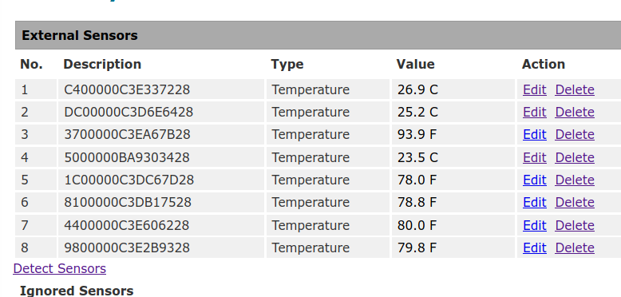

# Data Format

## EPICS IOC

With two asyn options, we can get the raw data such as

```bash
asynSetTraceIOMask("$(PORTNAME)",0,4)
# Enable ASYN_TRACE_ERROR and ASYN_TRACEIO_DRIVER on octet server
asynSetTraceMask("$(PORTNAME)",0,9)
```

```bash
00 05 00 00 00 6b 01 04 68 00 80 d7 41 00 80 c9 41 66 86 bb
42 00 00 bc 41 00 40 9c 42 9a 99 9d 42 33 13 a0 42 9a d9 9f
42 00 00 00 00 00 00 00 00 00 00 00 00 00 00 00 00 00 00 00
00 00 00 00 00 00 00 00 00 00 00 00 00 00 00 00 00 00 00 00
00 00 00 00 00 00 00 00 00 00 00 00 00 00 00 00 00 00 00 00
00 00 00 00 00 01 00 00 00 01 00 00 00
```

We have 8 sensors, so we tracked down which raw data could be the one.

* Data header

```bash
00 06 -> Counter
00 00 00 6b 01 04 68
```

* Sensors data

```bash
00 80 d7 41 -> Sensor 1
00 80 c9 41 -> Sensor 2
66 86 bb 42 -> Sensor 3
00 00 bc 41 -> Sensor 4
00 40 9c 42 -> Sensor 5
9a 99 9d 42 -> Sensor 6
33 13 a0 42 -> Sensor 7
9a d9 9f 42 -> Sensor 8
```

* Web interface

E1W has its own web site to show their monitoring values. And with the Modbus Poll application's help, I can find this is Little-Endian also.

||
| :---: |
|**Figure 1** NTI E1W Web Screenshot.|

* Data format is 32 bit floating. This combines two 16 bit Modbus registers. It can be displayed in 4 different word/byte orders such as Float Big-endian, Float Little-endian, Float Big-endian byte swap, and Float Little-endian byte swap [1]. However, EPICS Modbus has only two data types such as `FLOAT32_LE` and `FLOATE32_BE`.

For example, Sensor 4 has the following HEX data (the order of bytes 1234)

```bash
00 80 be 41
```

And with `FLOATE32_LE`, it can be translated to `be 40 00 80` (3412). The corresponding Floating value is `-0.187501907349`. However, the coversion value should be translated to `41 be 80 00` (4321) and the floating value is `23.8125`. That is the reasonable similar value as what we see in the web page, because this is the room temperature which I am measuring. Note that the conversion were done via the tools on a web site [2].

The important code is shown in `modbusApp/src/drvModbusAsyn.cpp`

```c
    asynStatus drvModbusAsyn::readPlcFloat(modbusDataType_t dataType, int offset, epicsFloat64 *output, int *bufferLen)
    {

    ....

        case dataTypeFloat32LE:
            uIntFloat.ui16[w32_0] = data_[offset];
            uIntFloat.ui16[w32_1] = data_[offset+1];
            *output = (epicsFloat64)uIntFloat.f32;
            *bufferLen = 2;
            break;

        case dataTypeFloat32LEBS:
            uIntFloat.ui16[w32_0] = htons(data_[offset]);
            uIntFloat.ui16[w32_1] = htons(data_[offset+1]);
            *output = (epicsFloat64)uIntFloat.f32;
            *bufferLen = 2;
            break;
    .....
    }
```

, where `htons` is defined in `EPICS_BASE/include/os/Linux/epicsMMIODef.h`

* Working IOC

With the modified EPICS modbus module [3], the EPICS IOC can read all temperature values correctly.

||
| :---: |
|**Figure 2** EPICS IOC with the modified Modbus, and Phoebus Screenshot.|

## References

[1] <https://www.modbustools.com/mbpoll-user-manual.html#_32_bit_floating>

[2] <https://www.h-schmidt.net/FloatConverter/IEEE754.html>

[3] <https://github.com/jeonghanlee/modbus/tree/bswap16>
